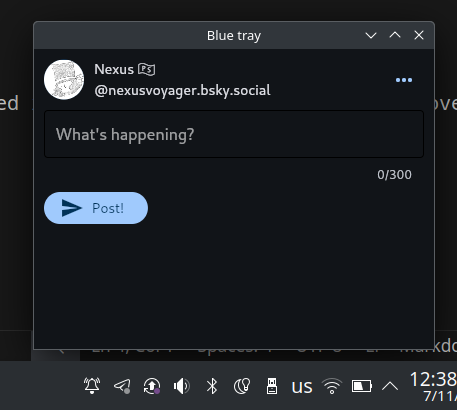

# Meet Blue Tray!
Blue tray is a simple python application for bluesky that's designed to help you post straight to bluesky (and any other bluesky instance!), I'm planning on expanding blue tray to other platforms while also adding features (and making sure the app isn't a cluttered mess of features)

## UPDATE!
I will be rewriting Blue Tray to move from flet to Qt or WxWidgets because Flet isn't very stable or complete yet! so there will be a delay!

[Bsky post regarding this, its the same thing though](https://bsky.app/profile/bluetray.bsky.social/post/3kx43vunkjj2e)

# Notices:
As of right now, Blue Tray doesn't have a proper login system nor does it open up in your system tray *yet*, I'm going to be working on properly developing Blue Tray and I'll work on polishing and cleaning the app for a Stable release!

# Work in progress  
- [ ] Implement a working login system
- [ ] Make the system tray icon work
- [ ] Allow for the use of multiple accounts
- [ ] Allow for users to add gifs and images
- and probably more things

# Social media
We're on bluesky!! [Bluesky account](https://bsky.app/profile/bluetray.bsky.social)

